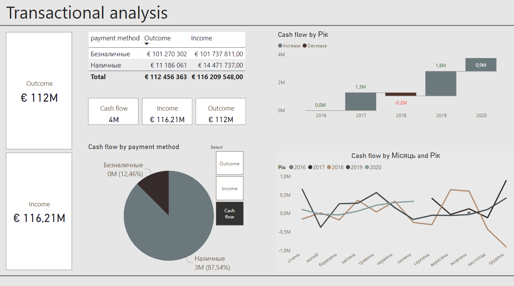

# Transaction Analysis Dashboard

Power BI dashboard that visualizes the company's cash flow by dividing it into cash and non-cash payments, and tracks its dynamics. Some labels are written in Cyrillic, as requested by the client.

